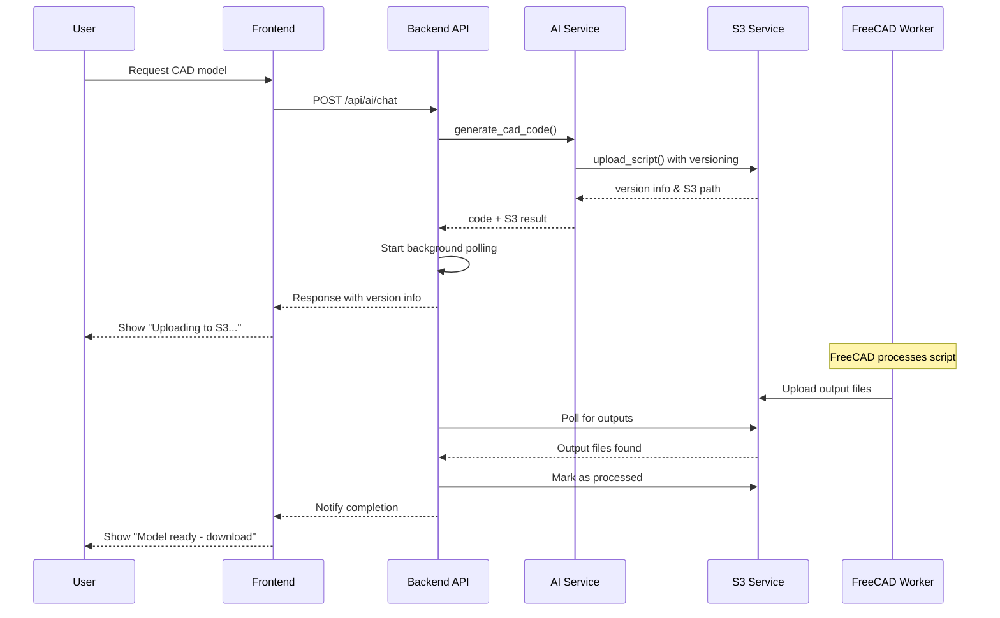

# S3 Integration Guide - AI-to-S3 Script Flow

This document describes the complete implementation of the AI-to-S3 script flow with automatic versioning and output retrieval.

## 🏗️ Architecture Overview

The system implements a complete pipeline from AI code generation to S3 storage with automatic versioning and FreeCAD processing integration.

### S3 Bucket Structure

```
freecad-automation-bucket/
├── input/{project_name}/{project_name}_v#.py
├── output/{project_name}/MyHeadlessModel.{FCStd|STL|STEP|OBJ}
├── logs/{project_name}/{project_name}_info_<timestamp>.log
└── processed/{project_name}/{project_name}_v#.py.done
```

## 🔧 Backend Implementation

### New Services

#### 1. S3Service (`services/s3_service.py`)
- **Auto-versioning**: Automatically increments version numbers for each project
- **Script upload**: Handles Python script uploads with metadata
- **Output polling**: Checks for processed model files
- **Download URLs**: Generates pre-signed URLs for secure downloads
- **Log management**: Retrieves processing logs

Key methods:
- `upload_script(code, project_name, user_id)` - Upload with auto-versioning
- `list_project_scripts(project_name)` - List all versions
- `get_script_content(project_name, version)` - Retrieve specific version
- `check_output_files(project_name)` - Check for processed outputs
- `generate_download_url(project_name, filename)` - Create download links

#### 2. Updated AI Service Integration
- Modified `ai_service.py` to use the new S3 service
- Passes user_id and project_id in context
- Returns S3 upload results with version information

### New API Endpoints

#### Script Management (`routes/scripts.py`)

```http
GET /api/projects/{project_name}/scripts
# List all script versions for a project

GET /api/projects/{project_name}/script/{version}
# Get content of specific script version

POST /api/projects/{project_name}/upload-script
# Upload new script with auto-versioning

GET /api/projects/{project_name}/outputs
# Get available output files

GET /api/projects/{project_name}/download/{format}
# Generate download URL for specific format

GET /api/projects/{project_name}/logs
# Get recent log files

GET /api/projects/{project_name}/status
# Get current processing status
```

#### Monitoring (`routes/monitoring.py`)

```http
GET /api/monitoring/health
# Comprehensive health check

GET /api/monitoring/s3/status
# Detailed S3 status (admin only)

GET /api/monitoring/ai/metrics
# AI service metrics (admin only)

POST /api/monitoring/test/s3-upload
# Test S3 upload functionality (admin only)

GET /api/monitoring/projects/{project_name}/processing-status
# Detailed processing status with S3 file states
```

## 🔄 Workflow Implementation

### 1. AI Code Generation Flow



### 2. Auto-Versioning Logic

```python
# Example versioning flow
project_name = "my_project"

# Check existing versions
existing_files = [
    "input/my_project/my_project_v1.py",
    "input/my_project/my_project_v2.py",
    "input/my_project/my_project_v3.py"
]

# Next upload becomes v4
next_version = 4
filename = f"input/{project_name}/{project_name}_v{next_version}.py"
```

### 3. Status Tracking

The system tracks multiple states:
- **no_scripts**: No scripts uploaded
- **processing**: Script uploaded, waiting for FreeCAD
- **completed**: Output files available
- **timeout**: Processing took too long
- **error**: Processing failed

## 📱 Frontend Integration

### Status Sequence Implementation

```javascript
// Status progression in UI
const statusStates = {
  'generating': 'Generating script…',
  'uploading': 'Uploading to S3…',
  'processing': 'FreeCAD processing…',
  'completed': 'Model ready — view or download'
};

// Polling for status updates
const pollStatus = async (projectName) => {
  const response = await fetch(`/api/projects/${projectName}/status`);
  const status = await response.json();
  updateUI(status.status_info.status);
};
```

### Download Integration

```javascript
// Download output files
const downloadModel = async (projectName, format) => {
  const response = await fetch(`/api/projects/${projectName}/download/${format}`);
  const { download_url } = await response.json();
  
  // Open download URL
  window.open(download_url, '_blank');
};
```

## ⚙️ Configuration

### Environment Variables

Add to `.env`:

```bash
# AWS S3 Configuration
AWS_ACCESS_KEY_ID=your-aws-access-key-id
AWS_SECRET_ACCESS_KEY=your-aws-secret-access-key
AWS_BUCKET_NAME=freecad-automation-bucket
AWS_REGION=us-east-1
```

### S3 Bucket Setup

1. Create S3 bucket with the specified name
2. Set up appropriate IAM permissions
3. Configure CORS if needed for direct frontend access

```json
{
  "Version": "2012-10-17",
  "Statement": [
    {
      "Effect": "Allow",
      "Action": [
        "s3:GetObject",
        "s3:PutObject",
        "s3:DeleteObject",
        "s3:ListBucket"
      ],
      "Resource": [
        "arn:aws:s3:::freecad-automation-bucket",
        "arn:aws:s3:::freecad-automation-bucket/*"
      ]
    }
  ]
}
```

## 🔍 Monitoring & Debugging

### Health Checks

```bash
# Check overall system health
curl http://localhost:8000/api/monitoring/health

# Check S3 specific status (admin)
curl -H "Authorization: Bearer <token>" \
     http://localhost:8000/api/monitoring/s3/status

# Test S3 upload (admin)
curl -X POST -H "Authorization: Bearer <token>" \
     http://localhost:8000/api/monitoring/test/s3-upload
```

### Processing Status

```bash
# Get detailed processing status
curl http://localhost:8000/api/monitoring/projects/my_project/processing-status
```

### Log Access

```bash
# Get recent logs for a project
curl http://localhost:8000/api/projects/my_project/logs

# Get specific log content
curl http://localhost:8000/api/projects/my_project/logs/my_project_info_20241011_123456.log
```

## 🚀 Deployment Considerations

### Production Setup

1. **S3 Bucket**: Use production bucket with proper lifecycle policies
2. **IAM Roles**: Use IAM roles instead of access keys in production
3. **Monitoring**: Set up CloudWatch for S3 and application metrics
4. **Backup**: Configure S3 versioning and backup policies
5. **Security**: Enable S3 encryption and secure access policies

### Performance Optimization

1. **Connection Pooling**: S3 client uses connection pooling
2. **Async Operations**: All S3 operations are async
3. **Caching**: Consider caching frequently accessed scripts
4. **CDN**: Use CloudFront for output file distribution

## 🔧 Error Handling

The system includes comprehensive error handling:

- **S3 Connection Errors**: Graceful fallback when S3 is unavailable
- **Upload Failures**: Retry logic with exponential backoff
- **Processing Timeouts**: 10-minute timeout with status updates
- **File Not Found**: Proper 404 responses for missing files
- **Permission Errors**: Clear error messages for access issues

## 📊 Metrics & Analytics

The system tracks:

- Upload success/failure rates
- Processing times
- Version distribution per project
- Download patterns
- Error frequencies

Access metrics via:
```bash
curl http://localhost:8000/api/monitoring/ai/metrics
```

## 🔄 Future Enhancements

Potential improvements:
1. **Webhook Integration**: Real-time notifications when processing completes
2. **Batch Processing**: Handle multiple scripts simultaneously
3. **Preview Generation**: Auto-generate thumbnails for output files
4. **Version Comparison**: Compare different script versions
5. **Collaborative Features**: Share scripts between users
6. **Advanced Analytics**: Detailed usage and performance analytics
